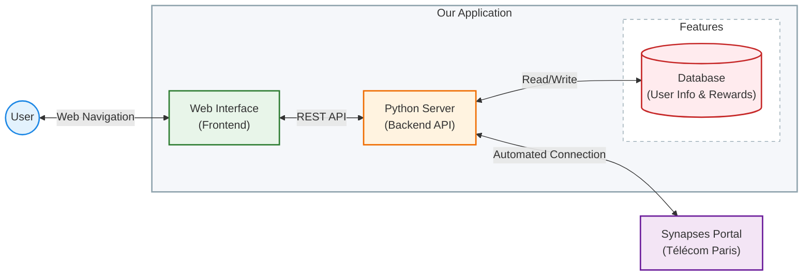
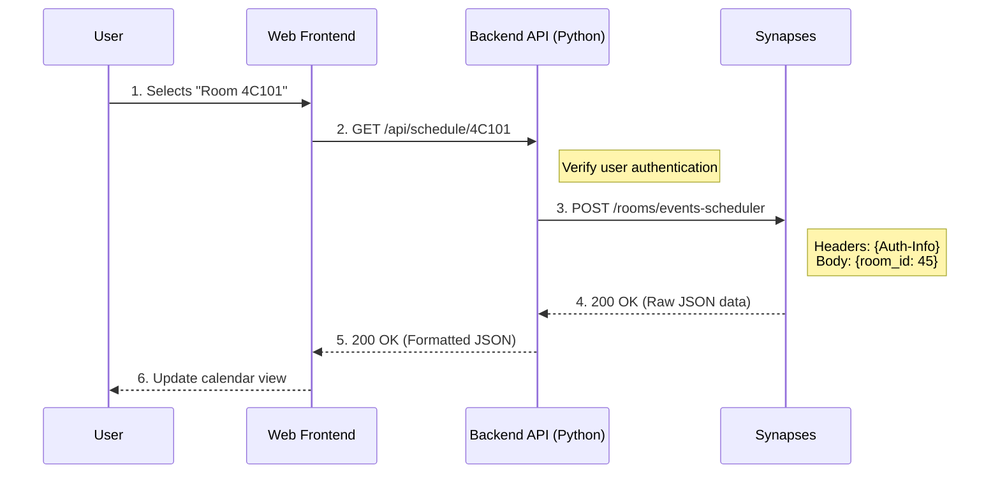
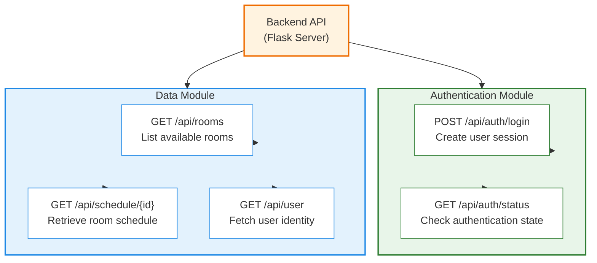

# Architecture de l'Application

Voici les schémas pour votre présentation.

### 1. Architecture Globale (Style "Carte")

### 2. Flux Détaillé : Récupération d'un Planning

Ce diagramme de séquence détaille les appels réseaux et les routes API utilisées.

**Légende pour l'oral :**
*   **En vert** : Ce qui se passe dans le navigateur de l'utilisateur.
*   **En orange/central** : Votre serveur qui enrichit la requête avec les cookies de session.
*   **En violet/droite** : Le serveur de l'école qui reçoit une requête officielle.

### 3. Liste des Endpoints API

Voici les principales routes utiles pour le projet, présentées sous forme de tableau.

